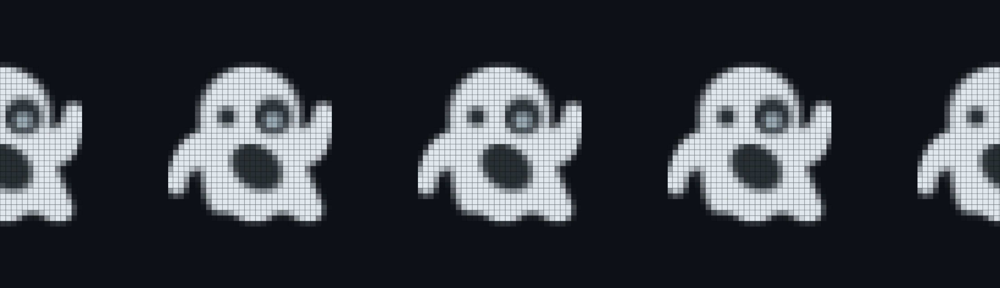

<!-- ===== HERO ===== -->

  <!-- Typing SVG -->
  

  <!-- Banner (반응형: 화면 80%, 최대 900px) -->
  

<!-- ===== TAGLINE (짧고 임팩트) ===== -->

  <strong>Graphics · XR Systems · AR-OS</strong>

<!-- ===== ORGANIZATION ===== -->
<h2 align="center">🥔 TheVicePotato 🥔</h2>

  <a href="https://github.com/thevicepotato"><b>TVP (TheVicePotato)</b></a> — the organization behind <i>Mashed</i> and <i>Turing</i>, focusing on XR/AR systems and OS-like ideas.

<!-- =========== current project ============ -->
<h2 align="center">🔨 Currently Building 🔨</h2>

  <ul style="list-style:none; padding:0; margin:0; text-align:left; display:inline-block;">
    <li><b>Mashed</b> — Immersive authoring experiments in XR/AR (Rust + wgpu)</li>
    <li style="margin-top:8px;"><b>Turing</b> — Calendar-centric productivity app (Flutter)</li>
  </ul>
  (Private development)

 
<!-- ===== TECH & INTERESTS (Centered, Symmetric) ===== -->
<h2 align="center">🛠️ Tech & Interests 🛠️</h2>

  <table style="width:100%; max-width:1000px; margin:0 auto; border-collapse:collapse; table-layout:fixed;">
    <thead>
      <tr>
        <th style="padding:12px; background:#f4f4f4; text-align:center; width:20%;">Category</th>
        <th style="padding:12px; background:#f4f4f4; text-align:center; width:26.6%;">Experienced</th>
        <th style="padding:12px; background:#f4f4f4; text-align:center; width:26.6%;">Currently Using</th>
        <th style="padding:12px; background:#f4f4f4; text-align:center; width:26.6%;">Interests</th>
      </tr>
    </thead>
    <tbody style="vertical-align:top;">
 <!-- Languages -->
      <tr>
        <td style="padding:12px; text-align:center;"><b>Languages</b></td>
        <td style="padding:12px; text-align:center;">
          
          
        </td>
        <td style="padding:12px; text-align:center;">
          
          
        </td>
        <td style="padding:12px; text-align:center;">
          
          
          
        </td>
      </tr>

<!-- Frameworks / Engines -->
  <tr>
        <td style="padding:12px; text-align:center;"><b>Frameworks / Engines</b></td>
        <td style="padding:12px; text-align:center;">
          
        </td>
        <td style="padding:12px; text-align:center;">
          
          
        </td>
        <td style="padding:12px; text-align:center;">
          
          
        </td>
      </tr>

<!-- Domains -->
  <tr>
        <td style="padding:12px; text-align:center;"><b>Domains</b></td>
        <td style="padding:12px; text-align:center;">
          
          
        </td>
        <td style="padding:12px; text-align:center;">
          
        </td>
        <td style="padding:12px; text-align:center;">
          
          
        </td>
      </tr>

<!-- Hardware -->
  <tr>
        <td style="padding:12px; text-align:center;"><b>Hardware</b></td>
        <td style="padding:12px; text-align:center;">—</td>
        <td style="padding:12px; text-align:center;">—</td>
        <td style="padding:12px; text-align:center;">
          
          
        </td>
      </tr>
    </tbody>
  </table>

