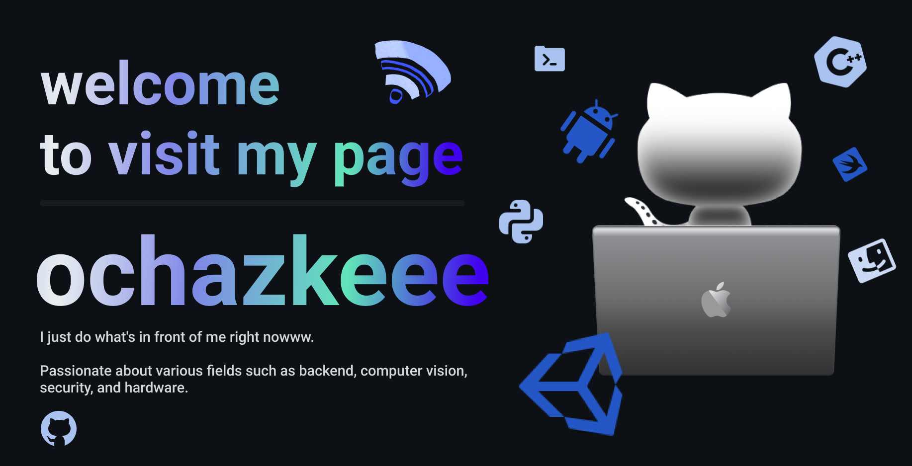

  <!-- Typing SVG -->
  
  
  <!-- banner image -->
  

<!-- my-skills -->

    <h2>Tech Stack</h2>

<table style="width: 100%; text-align: center; margin: 0 auto; border-collapse: collapse;">
    <tr>
        <th style="padding: 20px; font-size: 18px; background-color: #f4f4f4;">Property</th>
        <th style="padding: 20px; font-size: 18px; background-color: #f4f4f4;">Data</th>
    </tr>
    <tr>
        <td style="padding: 10px;">**Language / IDE**</td>
        <td style="padding: 10px;">
             
             
              
             
             
             
            
        </td>
    </tr>
    <tr>
        <td style="padding: 10px;">**Domain Knowledge**</td>
        <td style="padding: 10px;">
             
             
             
            
        </td>
    </tr>
    <tr>
        <td style="padding: 10px;">**CI / CD**</td>
        <td style="padding: 10px;">
             
             
             
             
             
             
            
        </td>
    </tr>
    <tr>
        <td style="padding: 10px;">**Databases**</td>
        <td style="padding: 10px;">
             
             
            
        </td>
    </tr>
    <tr>
        <td style="padding: 10px;">**Machine Learning / Deep Learning frameworks**</td>
        <td style="padding: 10px;">
            ![Jupyter Notebook Badge](http://img.shields.io/badge/-Jupyter%20Notebook-eee?style=flat-square&logo=data:image/png;base64,iVBORw0KGgoAAAANSUhEUgAAAA4AAAAQCAMAAAARSr4IAAACGVBMVEVhYmJdYWT/fBfzdyaqdlV2dnfcdC9udnz5dyKUaU3wdicCO2CzZzVdUkpOTk5MTk60ZzUAAP/XcC3fcivgciv/lArAajLqdSifYjrydyajnJjEjWifnp3FjGcAAACenp52dnd2dnd2dndhYmJhYmIxW3bzdybzdybzdybzdybzdyb/dxpydnl2dnd2dndhYmJgYmOda0r0dyXzdybzdybzdybudymQdmZldoJQYGmRaU7ydyfzdybzdybzdybzdybzdybzdybzdyb1dyX9dx/2dyXzdybzdybzdyb+eiPzdybzdybzdyb/ghz8eSQ3SFT/tABNTk5HTFBMTk5OTk5OTk5OTk5OTk5OTk5OTk5OTk5OTk5NTk5GTFBOTk5OTk5OTk5OTk5OTk5OTk5OTk5OTk5OTk5OTk5OTk5OTk5OTk5OTk5OTk5OTk5NTk5OTk5OTk5OTk5OTk5OTk5OTk5OTk5O
